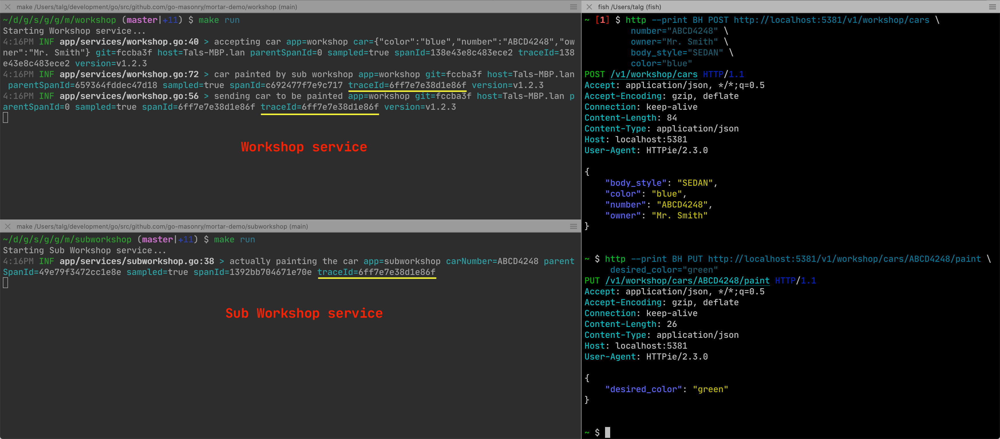
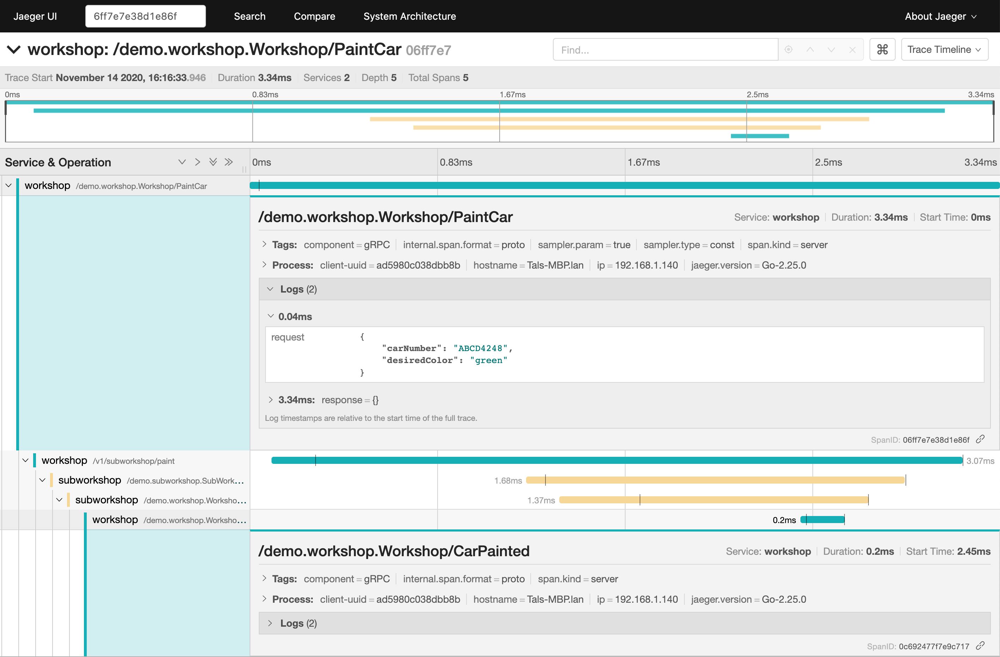
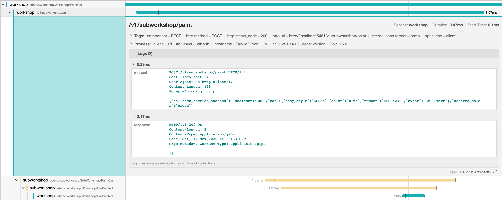
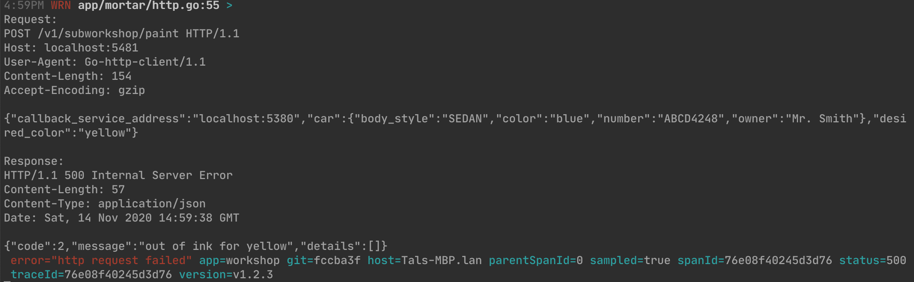
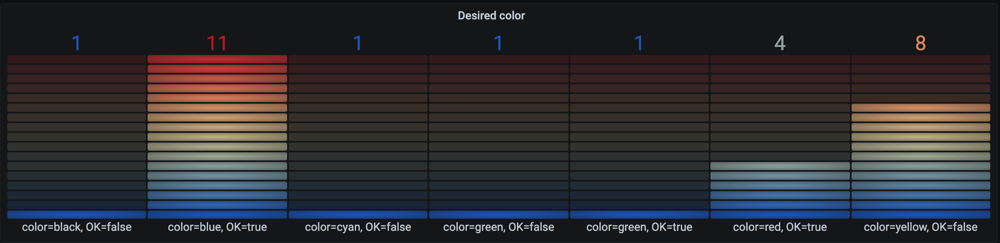

# Mortar


[](https://codecov.io/gh/go-masonry/mortar)
[](https://pkg.go.dev/mod/github.com/go-masonry/mortar)
[](https://goreportcard.com/report/github.com/go-masonry/mortar)

<p align="center">
    
</p>

Mortar is a GO framework/library for building gRPC (and REST) web services.
Mortar has out-of-the-box support for configuration, application metrics, logging, tracing, profiling, dependency injection and more.
While it comes with predefined defaults Mortar gives you total control to fully customize it.

## Demo

Clone this [demo](http://github.com/go-masonry/mortar-demo) repository and play around.

When you done, read the [documentation](https://github.com/go-masonry/tutorial) or create your own service with some templates found [here](https://github.com/go-masonry/scaffolds).

## Features

### Telemetry (Everything connected)

* Logs have Tracing Information `traceId`=*6ff7e7e38d1e86f* **across services**
    

* Also visible in Jaeger `traceId`=*6ff7e7e38d1e86f* if it's sampled.
    

### Support for `*http.Client` Interceptors, so you can

* Add request and response info to Trace `traceId`=*6ff7e7e38d1e86f*

    

* Log/Dump requests and/or responses when http request fails.

    ```golang
    return func(req *http.Request, handler client.HTTPpHandler) (resp *http.Response, err error) {
        var reqBytes, respBytes []byte
        // If the response is Bad Request, log both Request and Response
        reqBytes, _ = httputil.DumpRequestOut(req, true) // it can be nil and it's ok
        if resp, err = handler(req); err == nil && resp.StatusCode >= http.StatusBadRequest {
            respBytes, _ = httputil.DumpResponse(resp, true) // it can be nil
            logger.WithError(fmt.Errorf("http request failed")).
            WithField("status",resp.StatusCode).
            Warn(req.Context(), "\nRequest:\n%s\n\nResponse:\n%s\n", reqBytes, respBytes)
        }
        return
    }
    ```

    

* Alter requests and/or responses (useful in [Tests](https://github.com/go-masonry/mortar-demo/blob/master/workshop/app/controllers/workshop_test.go#L162))

    ```golang
    func(*http.Request, clientInt.HTTPpHandler) (*http.Response, error) {
        // special case, don't go anywhere just return the response
        return &http.Response{
            Status:        "200 OK",
            StatusCode:    200,
            Proto:         "HTTP/1.1",
            ProtoMajor:    1,
            ProtoMinor:    1,
            ContentLength: 11,
            Body:          ioutil.NopCloser(strings.NewReader("car painted")),
        }, nil
    }
    ```

### Monitoring/Metrics support

Export to either Prometheus/Datadog/statsd/etc, it's your choice. Mortar only provides the Interface and also caches the metrics so you don't have to.

```golang
counter := w.deps.Metrics.WithTags(monitor.Tags{
 "color":   request.GetDesiredColor(),
 "success": fmt.Sprintf("%t", err == nil),
}).Counter("paint_desired_color", "New paint color for car")

counter.Inc()
```



### Additional Features

There are a some features not listed here, please check the Tutorial for more.

> If you want to skip reading just jump to this [part](https://github.com/go-masonry/tutorial/tree/master/05-middleware) in the Tutorial.

## [Documentation](https://github.com/go-masonry/tutorial)

Mortar is not a drop-in replacement.

It's important to read its documentation first, starting with the step by step [Tutorial](https://github.com/go-masonry/tutorial) which is also a bit-of-everything example.

## Scaffolds

To help you bootstrap your services with Mortar [here](https://github.com/go-masonry/scaffolds) you can find different templates.
