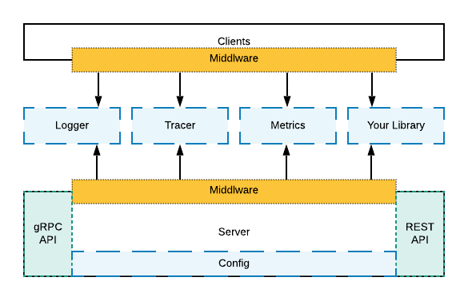

# Mortar 

Mortar is a lightweight GO framework/library for building gRPC (and REST) web services.
Mortar has out-of-the-box support for configuration, application metrics, logging, tracing, profiling and much more.
While it comes with predefined defaults Mortar gives you total control to fully customize it.

Mortar is based on an internal project developed within [Here-Mobility](https://mobility.here.com/) where it powered hundreds of different services.

## Overview of Building ~~Blocks~~ Bricks

## Motivation

- Focus on business logic
- All services speak the same "design" language
- Reduce boilerplate code
- Swap/Update dependencies/libraries easily
- Test friendly

## Documentation

Mortar is not a drop-in replacement. It will probably change the way you code and build services.
It's important to read its documentation first, starting with the [Tutorial](https://github.com/go-masonry/tutorial) which is also a bit-of-everything example.

### Core Concepts

- [Builders](wiki/builder.md)
- [Configuration](wiki/config.md)
- [Middleware](wiki/middleware.md)
- [Dependency Injection](wiki/di.md)
- [Multiple Web Servers](wiki/multiweb.md)

### Everything else

TODO: document all the built in features

## Moulds

Mortar can be viewed as [Trait](https://en.wikipedia.org/wiki/Trait_(computer_programming)), but for it to work you need add your logic.

Here you can find service templates to help you get started.

## Bricks 

Mortar defines different interfaces, without implementing them.
There are a lot of great libraries that can be used to implement them.
They just need to be (wrapped) first.

We call them [Bricks](wiki/bricks.md).

### Logger

- [zerolog](https://github.com/go-masonry/bzerolog)

### Configuration

- [viper](https://github.com/go-masonry/bviper)

### Monitoring/Metrics

- [bdatadog](https://github.com/go-masonry/bdatadog)

### Tracing

- [jaeger](https://github.com/go-masonry/bjaeger)  

